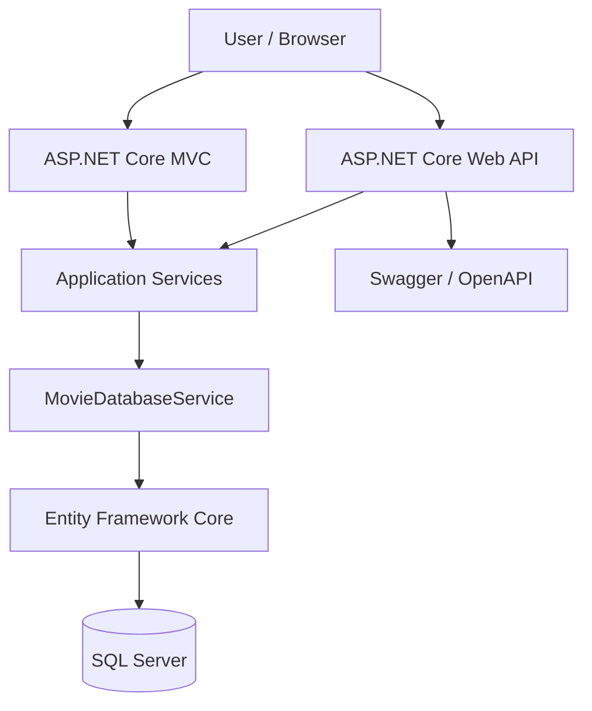
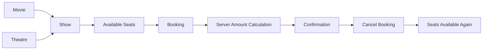
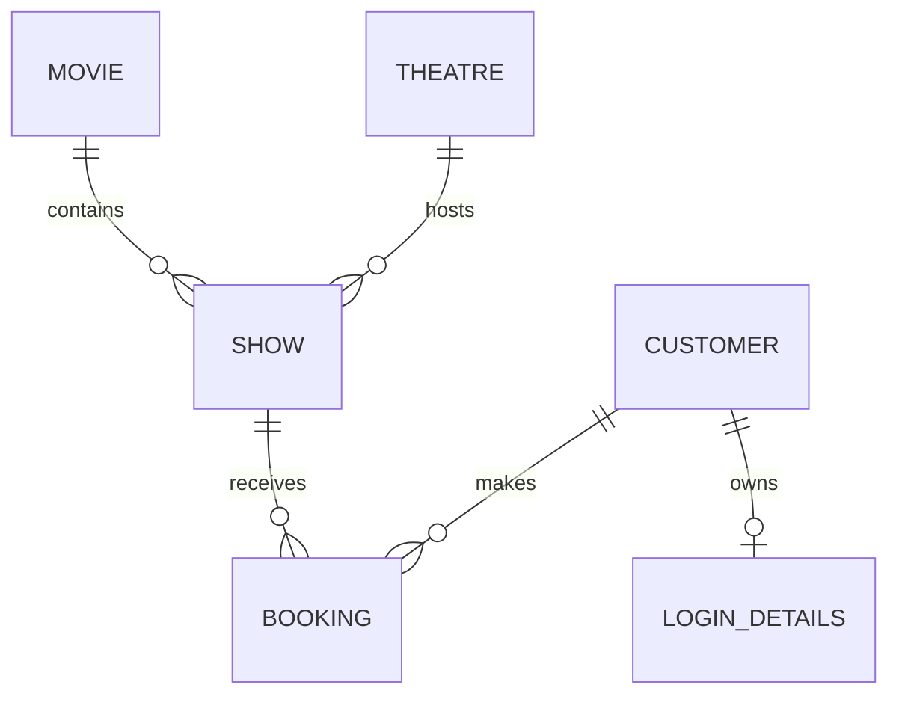

# Movie Ticket Booking System

<p align="center">
  <strong>A full-stack academic movie booking application built with ASP.NET Core, MVC, Web API, Entity Framework Core, and SQL Server.</strong>
</p>

<p align="center">
  <a href="https://github.com/akashray398/Movie-Ticket-Booking"></a>
  
  
  
  
</p>

## About

Movie Ticket Booking is a training and viva-ready application that demonstrates how a simple C# console project can evolve into a maintainable web application. It supports movie catalog management, theatres, shows, customers, login, seat availability, booking, pricing, confirmation, cancellation, and REST API access.

The project was implemented progressively in six sections so each technology can be explained clearly during a Wipro training viva.

## Highlights

- Movie, theatre, show, customer, login, and booking management
- ASP.NET Core MVC pages using Razor views
- RESTful Web API controllers with Swagger/OpenAPI
- SQL Server persistence through Entity Framework Core
- EF Core migrations and startup demo-data seeding
- DTO-based API contracts
- Dependency injection and service-layer business logic
- Global exception-handling middleware
- Server-side booking amount calculation
- Show-specific available-seat calculation
- Duplicate and occupied-seat validation
- Booking cancellation with seat release
- CSV persistence retained as a separate earlier section
- Logical microservice boundaries suitable for academic discussion
- Responsive Bootstrap-based interface

## Architecture



### Booking flow



### Data relationships



## Technology Stack

| Area | Technology |
|---|---|
| Language | C# |
| Runtime | .NET 10 |
| Web framework | ASP.NET Core |
| Frontend | ASP.NET Core MVC, Razor, HTML, CSS, Bootstrap |
| API | ASP.NET Core Web API, REST, Swagger/OpenAPI |
| ORM | Entity Framework Core |
| Database | Microsoft SQL Server Express |
| Querying | LINQ |
| Persistence exercise | CSV file handling |
| Design concepts | OOP, dependency injection, middleware, service layer, microservices concepts |

## Project Structure

```text
Movie-Ticket-Booking/
├── .gitignore
├── LICENSE
├── README.md
└── MovieTicketBooking/
    ├── Controllers/
    │   └── ApiControllers.cs
    ├── Data/
    │   └── MovieDataStore.cs
    ├── Database/
    │   ├── DatabaseConnectionSettings.cs
    │   ├── DatabaseInitializer.cs
    │   ├── MovieDatabaseService.cs
    │   ├── MovieDbContext.cs
    │   ├── MovieDbContextFactory.cs
    │   └── Migrations/
    ├── DTOs/
    ├── Exceptions/
    ├── Models/
    ├── Middleware/
    ├── Services/
    ├── Views/
    ├── Web/Controllers/
    ├── wwwroot/css/
    ├── DataFiles/
    ├── Program.cs
    ├── appsettings.json
    └── MovieTicketBooking.csproj
```

## Six Sections

| Section | Subject | Result |
|---:|---|---|
| 1 | C# and OOP foundations | Domain models and console application |
| 2 | Exception handling and validation | Custom exceptions and input rules |
| 3 | Booking and CRUD | In-memory store, search, seat rules, cancellation |
| 4 | CSV persistence | File-based storage using `MovieDataStore` |
| 5 | SQL Server and EF Core | Relational database, mappings, migrations |
| 6 | ASP.NET Core application | MVC, Web API, Swagger, login, seeding, and complete booking flow |

## Setup

### Prerequisites

- Windows
- .NET SDK 10.0 or compatible SDK
- SQL Server Express with the `SQLEXPRESS` instance running
- Git
- Optional: SQL Server Management Studio and a browser

### Clone the repository

```powershell
git clone https://github.com/akashray398/Movie-Ticket-Booking.git
cd Movie-Ticket-Booking
```

### Configure SQL Server

The local development connection uses:

```text
Server=.\SQLEXPRESS;Database=MovieTicketBookingDB;Trusted_Connection=True;TrustServerCertificate=True;
```

Keep machine-specific settings in the ignored file `MovieTicketBooking/appsettings.Development.json`. Do not commit passwords, API keys, or production connection strings.

### Build and run

From the repository root:

```powershell
dotnet restore
dotnet build
dotnet ef database update --project .\MovieTicketBooking\MovieTicketBooking.csproj
dotnet run --project .\MovieTicketBooking\MovieTicketBooking.csproj
```

Or from the project directory:

```powershell
cd .\MovieTicketBooking
dotnet run
```

The application applies the existing migration and seeds demonstration records during startup.

## Demo Credentials

### Administrator

```text
Login ID: MOVIEADMIN
Password: MOVIEADMIN
Login type: A
```

### Seeded customers

```text
Login ID: 1001
Password: 1001
Login type: C

Login ID: 1002
Password: 1002
Login type: C
```

These credentials are intentionally simple for academic demonstration and are not production authentication.

## Application Routes

| Page | Route |
|---|---|
| Home | `/` |
| Movies | `/Movies` |
| Theatres | `/Theatres` |
| Shows | `/Shows` |
| Available seats | `/Shows/AvailableSeats/{showId}` |
| Customers | `/Customers` |
| Bookings | `/Bookings` |
| Create booking | `/Bookings/Create` |
| Confirmation | `/Bookings/Confirmation/{bookingId}` |
| Admin dashboard | `/Admin` |
| Login | `/Login` |
| Swagger | `/swagger` |

## REST API

### Movies

```http
GET    /api/movies
GET    /api/movies/{movieId}
GET    /api/movies/search?name=action
POST   /api/movies
PUT    /api/movies/{movieId}
DELETE /api/movies/{movieId}
```

### Theatres, customers, and shows

```http
GET, POST, PUT, DELETE /api/theatres
GET, POST, PUT, DELETE /api/customers
GET, POST, PUT, DELETE /api/shows
GET /api/shows/{showId}/available-seats
```

### Bookings and login

```http
GET, POST, PUT, DELETE /api/bookings
GET /api/bookings/{bookingId}
GET /api/bookings/show/{showId}/available-seats
PUT /api/bookings/{bookingId}/cancel
POST /api/login
```

### Example booking request

```json
{
  "customerName": "Asha",
  "email": "asha@example.com",
  "showID": 2001,
  "seatType": "Gold",
  "numberOfSeats": 2,
  "seatNumbers": [3, 4]
}
```

The server calculates the amount using the selected show's Gold rate. The client cannot be trusted to provide the final amount.

## HTTP Status Codes

- `200 OK`: successful read or operation
- `201 Created`: resource created
- `204 No Content`: successful update or deletion
- `400 Bad Request`: validation failure
- `401 Unauthorized`: invalid login
- `404 Not Found`: missing resource
- `409 Conflict`: occupied seats or database conflict
- `500 Internal Server Error`: unexpected failure

## Viva Explanation

> Movie Ticket Booking is an ASP.NET Core MVC and Web API application backed by SQL Server and Entity Framework Core. It manages movies, theatres, shows, customers, logins, and bookings. MVC provides the browser interface, Web API exposes JSON endpoints, services contain business rules, EF Core maps the domain models to SQL Server, and middleware handles unexpected exceptions. During booking, the application validates the show, seat count, seat type, duplicate seats, and availability. It calculates the amount on the server from the selected show rate. Cancellation keeps the booking for history while making its seats available again. The service boundaries also demonstrate how Movie, Theatre/Show, Booking, and Customer modules could later become microservices.

### Useful viva questions

**Why use DTOs?**  DTOs define safe API contracts and avoid exposing database entities or accepting trusted values such as generated IDs and booking amounts.

**Why use EF Core migrations?**  Migrations version the database schema and keep database changes synchronized with the C# model.

**Where is business logic placed?**  Controllers stay thin; validation, pricing, seat availability, and persistence orchestration are handled by application services.

**How does cancellation release seats?**  A booking is marked `Cancelled`, and available-seat queries ignore cancelled bookings instead of deleting the record.

**Why use MVC and Web API together?**  MVC serves the browser UI, while Web API supports Swagger, integrations, mobile clients, and future frontends.

**How are microservices demonstrated?**  The application has logical service boundaries without duplicating database code or pretending that separate processes exist.

**What are the limitations?**  Login is an academic demonstration, passwords are not production-grade, and there is no payment gateway, distributed deployment, or advanced concurrency strategy.

## Testing Checklist

- `dotnet build`
- EF migration update
- MVC home, catalog, show, booking, login, and admin pages
- Swagger loads and lists API endpoints
- Movie, theatre, customer, show, and booking CRUD
- Invalid language, duration, seat count, seat type, show ID, and email
- Duplicate and already-booked seats
- Server-side amount calculation
- Booking confirmation
- Cancellation and seat release
- Admin login and seeded customer login
- CSV persistence from Section 4

## GitHub Contribution Workflow

```powershell
git status
git add .
git commit -m "Complete Movie Ticket Booking System"
git push origin main
```

Generated files and local settings are excluded by `.gitignore`. Review `git status` before every push.

## Known Limitations

This project is intended for Wipro training and academic viva demonstration. It does not claim production-grade authentication, payment processing, distributed microservices, advanced monitoring, high-concurrency reservation locking, or a production deployment pipeline.

## License

This project is licensed under the MIT License. See [LICENSE](LICENSE).

Copyright (c) 2026 Akash Yadav

## Author

**Akash Yadav**

- GitHub: [@akashray398](https://github.com/akashray398)
- Repository: [Movie-Ticket-Booking](https://github.com/akashray398/Movie-Ticket-Booking)
